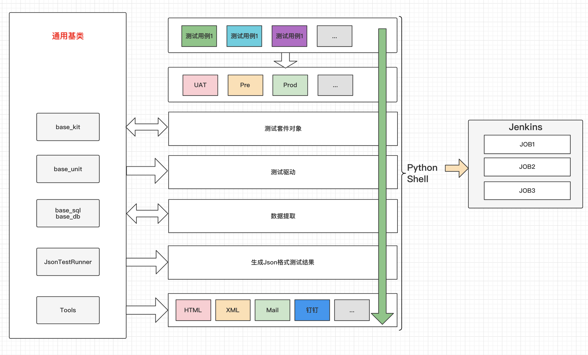
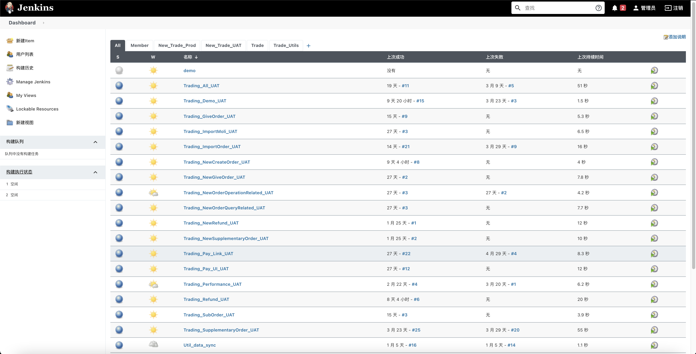

# KitDriverCase

KitDriverCase套件驱动用例，自动化测试。



### 前言

KitDriverCase接口自动化测试，套件驱动用例设计思想，包括复杂的业务链路检验以及数据库字段校验，适用于中台微服务等场景。

### 描述

以订单服务为例，订单服务看作一个公共的套件即：OrderServiceCommonKit，一个订单服务下有很多子模块，那么把这些子模块看作很多的Kit，都继承 OrderServiceCommonKit。

### 安装

- 安装:python3.9.x

```text
Windows:
    https://www.python.org/ftp/python/3.9.4

Mac:
    https://www.python.org/ftp/python/3.9.4/python-3.9.4-macosx10.9.pkg

Linux:
    wget https://www.python.org/ftp/python/3.9.4/Python-3.9.4.tgz
```

- 库

```shell script
pip3 install urllib3
pip3 install requests
pip3 install redis
pip3 install pymysql
pip3 install selenium
pip3 install xlrd
pip3 install openpyxl
pip3 install pandas
pip3 install xmind
pip3 install shortuuid
# 统一安装
pip3 install urllib3 requests redis pymysql selenium xlrd openpyxl pandas xmind shortuuid
```

- 安装 Redis 并启动
```text
https://redis.io
```

### 开始

以订单服务为例

- 创建模块如：/KitDriverCase/business/interfaces/order_service
- 创建用例如：/KitDriverCase/business/interfaces/order_service/case
- 创建套件如：/KitDriverCase/business/interfaces/order_service/kits

### 定义套件

以订单服务为例

- [/business/interfaces/order_service/kits/kits.py](business/interfaces/order_service/kits/kits.py)
- 继承基础套件：BaseKit(包括了很多基础方法，下面介绍)
- 数据库连接类：BaseDataBases(下面会介绍如何配置数据库)
- 类中定义一些你所需要的公共属性和方法 如：base url，环境，参数等等

```python
from all_reference import *


class OrderServiceCommonKit(BaseKit, BaseDataBases):
    """订单服务通用套件"""

    env = "uat"

    order_url_dict = {
        'def': 'https://uat-order.xxxxxx.cn',
        'uat': 'https://uat-order.xxxxxx.cn',
        'pre': 'https://pre-order.xxxxxx.cn',
        'prod': 'https://order.xxxxxx.cn'
    }
    base_order_url = order_url_dict.get(env, 'def')

    def func_1(self):
        """1"""

    def func_2(self):
        """1"""

    def func_3(self):
        """1"""
```

以订单服务-子模块创建订单为例

- [/business/interfaces/order_service/kits/create_order_kit.py](business/interfaces/order_service/kits/create_order_kit.py)
- 创建订单的通用套件：CreateOrderKit，继承：OrderServiceCommonKit
- 定义创建订单所需要的属性和方法 如：url，环境，参数等等

```python
from business.interfaces.order_service.kits.kits import OrderServiceCommonKit


class CreateOrderKit(OrderServiceCommonKit):
    """创建订单"""

    createOrder = '/order/v1/ol-order/createOrder'

    req_json_data = {
        "userId": 123456,
        "price": 8800.00,
        "payType": 99
    }

    def query_order(self, order_id):
        """查询订单表"""
        db = self.return_db(db_name='order')
        sql = """select * from `order` where id={}""".format(order_id)
        result = db.select(sql=sql, only=True)
        return result

    def assert_order(self, *args, **kwargs):
        """校验order表字段"""

    def assert_order1(self):
        """assert_order1"""

    def assert_order2(self):
        """assert_order2"""

    def assert_order3(self):
        """assert_order3"""
```

### 套件编写

- [/business/interfaces/order_service/case/test_CreateOrder.py](business/interfaces/order_service/case/test_CreateOrder.py)
- 实例化套件：kit_obj = CreateOrderKit()，使用到的属性，方法等都会在kit_obj实例中
- 定义请求体：url，headers，send
- 以下代码是伪代码例子，实际需要根据你的真实参数，请求体，方法

```python
from all_reference import *
from business.interfaces.order_service.kits.create_order_kit import CreateOrderKit

kit_obj = CreateOrderKit()

url = kit_obj.base_order_url + kit_obj.createOrder

headers = {
    "": ""
}

send = {
    "url": url,
    "headers": "",
    "json": kit_obj.get_test_data('req_json_data'),  # kit_obj.get_test_data取值防止数据被覆盖
    # "json": kit_obj.req_json_data,  # 不考虑覆盖的情况可是直接使用 kit_obj.req_json_data 直接调用
    "other": {
        "center_name": "order"
    }
}

# 多表校验，定义表名为key，方法为value
table_dict = {
    "order_001": kit_obj.assert_order1,
    "order_002": kit_obj.assert_order2,
    "order_003": kit_obj.assert_order3
}


class TestCreateOrder(BaseUnit):
    """测试创建订单"""

    def test_001(self):
        """基本使用"""
        # 发起请求
        resp = kit_obj.current_request(method="post", **send)

        # 获取返回值
        result = resp.json()

        # 基本断言
        kit_obj.assert_json(result, 'code', 200)
        kit_obj.assert_json(result, 'message', '操作成功')

        # 取值断言
        order_number = result.get('data').get('order_number')
        assert order_number == 123456, '订单号错误'

        # 查询数据库数据
        query_order = kit_obj.query_order(order_number)

        # 断言数据库字段
        assert query_order.get('price') == 8800.00

    @kit_obj.assert_field(table_name='order_001', table_dict=table_dict)
    @kit_obj.assert_field(table_name='order_002', table_dict=table_dict)
    @kit_obj.assert_field(table_name='order_003', table_dict=table_dict)
    def test_002(self):
        """多表校验"""
        kit_obj.show_result_list()

```

### 数据库配置

- 本地配置文件： [/config/server_config.ini](/config/local_config.ini)
- 部署到服务器的配置文件：[/config/server_config.ini](/config/server_config.ini)
- 数据库连接基类：[/common/base_lib/base_db.py](/common/base_lib/base_db.py)

以本地配置文件：配置redis，mysql，es为离例子如下

- local_config.ini 中新增配置

```ini
[redis]
REDIS_HOST = localhost
REDIS_PORT = 6379
REDIS_PWD = 123456
REDIS_DB = 3
DECODE_RESPONSES = True

[mysql]
UAT_HOST = uat-mysql-xxxxx-xxxx.net
UAT_USER = uat_test
UAT_PWD = 123456
UAT_DB = online
UAT_DB_LIST = ['online','assets_center','commodity_order','admin_service', 'message_notify', 'member_center', 'commodity','trade_order']
UAT_PORT = 3306

[es]
ES_URL = http://xxxxxxxxxx.elasticsearch.aliyuncs.com:9200
ES_USER = uat_test
ES_PWD = 123456

```

- base_db.py 中 DbConnectionConfig 定义配置 redis_obj,uat_db_connection,uat_es_connection
- base_db.py 中 BaseDataBases 定义连接 get_redis(),return_db(),return_es() 具体连接里面的逻辑根据你的需要去实现
- 定义好并调通后，你可以回到上面 [create_order_kit.py](business/interfaces/order_service/kits/create_order_kit.py)使用它

```python
class DbConnectionConfig:
    """数据连接配置"""
    conf = get_config()
    redis_obj = {
        'host': conf.get('redis', 'REDIS_HOST'),
        'port': conf.get('redis', 'REDIS_PORT'),
        'password': conf.get('redis', 'REDIS_PWD'),
        'decode_responses': conf.getboolean('redis', 'DECODE_RESPONSES'),
        'db': conf.getint('redis', 'REDIS_DB')
    }
    POOL = redis.ConnectionPool(**redis_obj)
    R = redis.Redis(connection_pool=POOL)

    uat_db_connection = {
        'host': conf.get('mysql', 'UAT_HOST'),
        'user': conf.get('mysql', 'UAT_USER'),
        'password': conf.get('mysql', 'UAT_PWD'),
        'db': conf.get('mysql', 'UAT_DB'),
        'port': conf.getint('mysql', 'UAT_PORT'),
    }

    uat_es_connection = {
        'url': conf.get('es', 'ES_URL'),
        'user': conf.get('es', 'ES_USER'),
        'pwd': conf.get('es', 'ES_PWD')
    }


class BaseDataBases(DbConnectionConfig):
    """db"""

    @classmethod
    def return_default_db(cls, env):
        """
        默认 onlien 库
        """
        if env == 'uat':
            return MyPyMysql(**cls.uat_db_connection)

        if env == 'pre':
            return MyPyMysql(**cls.pre_db_connection)
        else:
            msg = 'return_db -> 变量:{} 错误'.format(env)
            print(msg)
            return False

    def get_env(self):
        """
        获取环境
        :return:
        """
        try:
            return self.get_redis().get('env')

        except BaseException as e:
            print('get_env -> redis err -> {}'.format(str(e)))
            return False

    def get_redis(self):
        """
        获取Redis
        :return:
        """
        try:
            return self.R

        except BaseException as e:
            print('return_redis -> redis err -> {}'.format(str(e)))
            return False

    def return_db(self, db_name=None):
        """
        获取数据库
        :return:
        """
        if db_name and self.get_env() == 'uat':
            try:
                before_uat_db_connection = self.uat_db_connection.copy()
                before_uat_db_connection['db'] = db_name
                return MyPyMysql(**before_uat_db_connection)

            except BaseException as e:
                print('return_db -> 变量:{}'.format(self.get_env()))
                print('UAT:未找到该数据库名称:{}'.format(db_name))
                print(str(e))
                return False

        if db_name and self.get_env() == 'pre':
            try:

                before_pre_db_connection = self.pre_db_connection.copy()
                before_pre_db_connection['db'] = db_name
                return MyPyMysql(**before_pre_db_connection)

            except BaseException as e:
                print('return_db -> 变量:{}'.format(self.get_env()))
                print('PRE:未找到该数据库名称:{}'.format(db_name))
                print(str(e))
                return False
        else:
            return self.return_default_db(self.get_env())

    def return_es(self, env='uat'):
        """获取es"""
        if env == 'uat':
            es = Elasticsearch(
                [self.uat_es_connection.get('url')],
                http_auth=(self.uat_es_connection.get('user'), self.uat_es_connection.get('pwd'))  # 认证信息
            )
        elif env == 'prod':
            prod_es_connection = {
                'url': self.conf.get('es_prod', 'ES_URL'),
                'user': self.conf.get('es_prod', 'ES_USER'),
                'pwd': self.conf.get('es_prod', 'ES_PWD')
            }
            es = Elasticsearch(
                [prod_es_connection.get('url')],
                http_auth=(prod_es_connection.get('user'), prod_es_connection.get('pwd'))  # 认证信息
            )
        else:
            es = None
            print('es 不存在')
        return es
```

### 集成测试

以上已经实现单个服务，单个模块的测试，下面介绍集成测试，生成报告，发送邮件，钉钉推送，对接其他平台等使用

邮件收发配置：[/local_config.ini](/config/local_config.ini)

- 带 DEBUG 后缀的用于调试

```ini
[mail]
TO_LIST = [
          'yuexiong.yang@happy-seed.com',
          ]
AC_LIST = [
          '417993207@qq.com'
          ]
TO_LIST_DEBUG = [
                'yuexiong.yang@happy-seed.com',
                '417993207@qq.com'
                ]
AC_LIST_DEBUG = [
                '1084911056@qq.com',
                '872540033@qq.com'
                ]
```

邮件账号配置：[/base_tools.py](/common/base_lib/base_tools.py)

- 配置 mail_from：发件邮箱账号 和 mail_pwd：发件邮箱的授权码(可以百度一下如何或获取)

```python
class SendEmail:
    """
    发送邮件
    """

    def __init__(self, YYX=False, DEBUG=True):

        self.YYX = YYX
        self.DEBUG = DEBUG

        if self.YYX:
            self.mail_from = '872540033@qq.com'  # 发件邮箱账号
            self.mail_pwd = ''  # 发件邮箱的授权码
        else:
            self.mail_from = ''  # 发件邮箱账号
            self.mail_pwd = ''  # 发件邮箱的授权码

        if self.DEBUG:  # True
            self.to_list = conf.get('mail', 'TO_LIST_DEBUG')
            self.ac_list = conf.get('mail', 'AC_LIST_DEBUG')
        else:  # False
            self.to_list = conf.get('mail', 'TO_LIST')
            self.ac_list = conf.get('mail', 'AC_LIST')

```

钉钉推送配置：[/global_env.py](/global_env.py)

```python
# 钉钉推送
DING_TALK_URL = ""  # token
AT_MOBILES = ["15013038819"]  # 用户
AT_USER_IDS = ["K2425"]  # 工号
IS_AT_ALL = False
```

JsonTestRunner使用：[/JsonTestRunner.py](/common/base_lib/JsonTestRunner.py)

- JsonTestRunner 生成报告已经在 run.py 调用：
- JsonTestRunner 可以单独使用，生成Json数据格式的测试结果集对接其他平台，具体使用在该文件中查看
- 启动文件：[/run.py](/run.py)

```python
"""
python3 run.py
默认执行整个工程下的测试用例

查看对应的shell自定义需要执行的测试用例以及生成测试报告的参数
python3 run.py -h

optional arguments:
  -h, --help           show this help message and exit
  --title TITLE        报告标题:如-平台发展自动化测试报告
  --desc DESC          报告描述:如-交易域
  --tester TESTER      测试人员
  --env ENV            运行环境(uat,pre,prod)
  --cf CF              默认全部,否则:指定路径用于配置jenkins区分job
  --fp FP              默认test开头全部,否则:指定某个文件
  --mail MAIL          是否发送邮件(1:是,0:否)
  --is_print IS_PRINT  打印json格式的测试结果(1:是,0:否)
  --is_xm IS_XM        生成XMind(1:是,0:否)

例如:
执行 uat 环境下,目录/OrderChannel 下的所有用例,发用邮件,生成XMind
python3 run.py --title 平台发展自动化测试报告 --desc 交易域 --tester 杨跃雄 --is_print 1 --env uat --cf /KitDriverCase/business --mail 1 --is_xm 1

又例如:
执行 uat 环境下,目录/OrderChannel 下文件名称为:test_SupplementaryOrder.py 的用例,发用邮件,生成XMind
python3 run.py --title 平台发展自动化测试报告 --desc 交易域 --tester 杨跃雄 --is_print 1 --env uat --cf /KitDriverCase/business --fp test_SupplementaryOrder.py --mail 1 --is_xm 1

以上按照所需要的命令配置Jenkins对应的Job即可
一个python shell 对应一个 Jenkins Job 如下
"""
```


